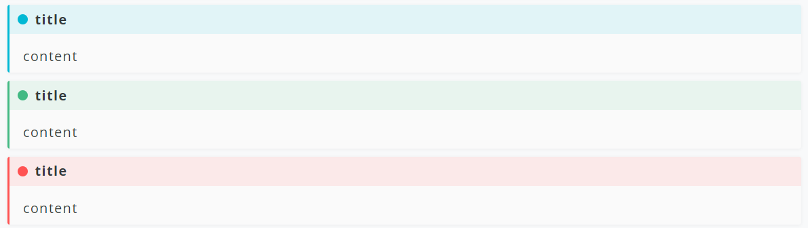
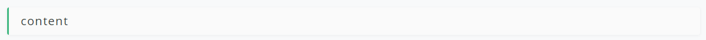

# Hexo tag scode

[](https://www.npmjs.com/package/hexo-tag-scode)
[](https://baoshuo.ren)
[](https://github.com/renbaoshuo/hexo-tag-admonition/blob/master/LICENSE)

## Installation

1. Install the plugin.
    ```
    npm install hexo-tag-scode --save
    ```
2. Add [styles](style.css) to your theme.

## Usage

Type this in your markdown file:

```

content



content



content

```

Then it will look like this:



## Advanced

`title` is an additional option, so if you don't add a title, it will look like this:



## Author

**Hexo tag scode** © [Baoshuo](https://github.com/renbaoshuo), Released under the [MIT](https://github.com/renbaoshuo/hexo-tag-admonition/blob/master/LICENSE) License.<br>
Authored and maintained by Baoshuo with help from contributors ([list](https://github.com/renbaoshuo/hexo-tag-scode/graphs/contributors)).

> [Personal Website](https://baoshuo.ren) · [Blog](https://blog.baoshuo.ren) · GitHub [@renbaoshuo](https://github.com/renbaoshuo) · Twitter [@renbaoshuo](https://twitter.com/renbaoshuo)
